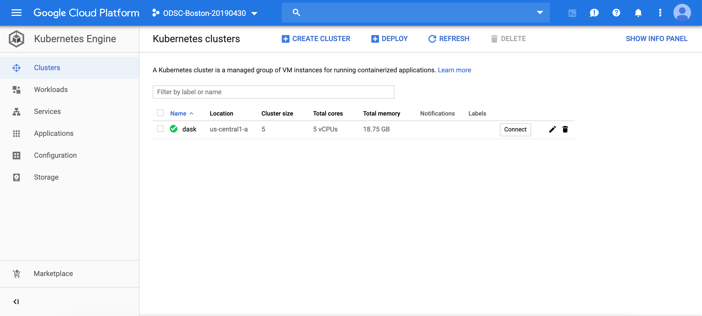
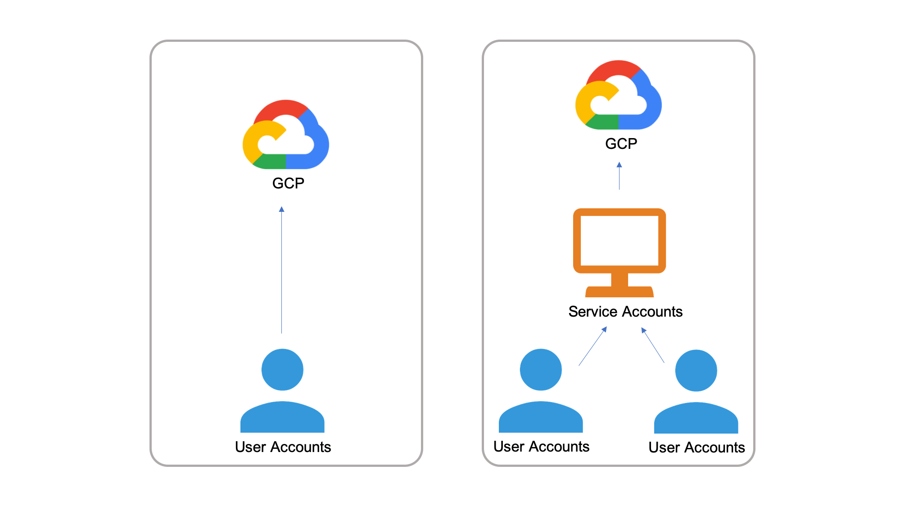
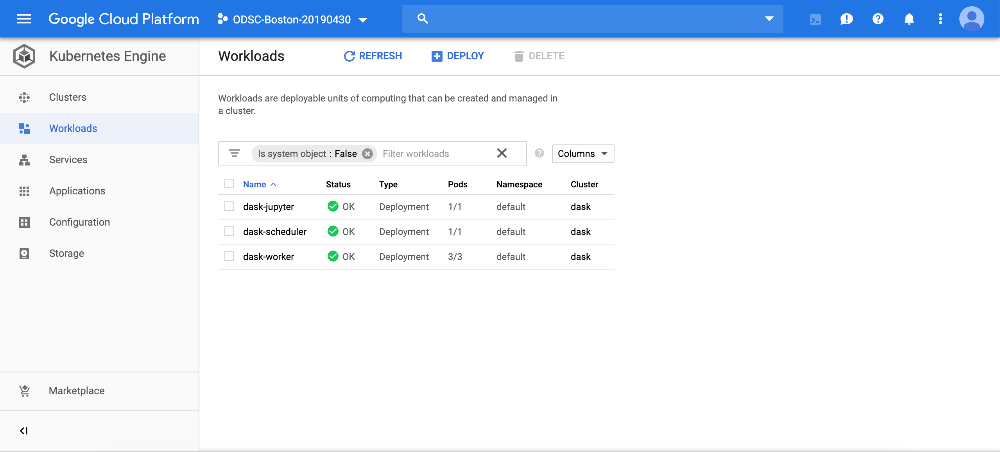

# Deploying Dask on Google Kubernetes Engine

## Create new Kubernetes cluster

In the last section of the tutorial, we used Google Cloud Console's browser interface to create a Kubernetes cluster. Here, we will use `gcloud` command-line tool in Cloud Shell

Using Google Cloud Shell, use the following gcloud command:

```bash
$ gcloud container clusters create dask \
                                  --zone us-central1-a \
                                  --machine-type n1-standard-1 \
                                  --num-nodes 5
```

This command will create a new Kubernetes cluster, `dask`, in `us-central1-a` zone with 5 instances of `n1-standard-1` Machine type.



---

# Helm - Kubernetes package manager

Helm is a Kubernetes package manager currently maintained by the Cloud Native Computing Foundation (CNCF). Helm has become quite popular with cloud developers largely because it simplifies Kubernetes application management, the roll out of updates, and options to share applications.

- [Helm Hub](https://hub.helm.sh/)

---

# Setting up Helm (and Tiller)

0. Install Helm:

`$ curl https://raw.githubusercontent.com/kubernetes/helm/master/scripts/get | bash`

---

## Role Based Access Control (RBAC)

RBAC is automatically enabled in Kubernetes cluster on GCP.

### User Accounts versuse Service Accounts

- User Accounts - Identifies a person administering a cluster

- Service Accounts - Identifies a pod administering a cluster



### Rolebinding

- ClusterRoleBinding: Grants a ClusterRole across the entire cluster, including all namespaces

  - `cluster-admin` - When used in a ClusterRoleBinding, it gives super-user access over every resource in the cluster and in all namespaces. When used in a RoleBinding, it gives super-user access over every resource in the rolebinding's namespace, including the namespace itself.

- RoleBinding: Grants a Role or ClusterRole within a specific namespace

  - `admin` - Allows admin/read/write access to most resources in a namespace, including the ability to create roles and rolebindings within the namespace. It does not allow write access to resource quota or to the namespace itself.

  - `edit` - Allows read/write access to most objects in a namespace. It does not allow viewing or modifying roles or rolebindings.

  - `view` - Allows read-only access to see most objects in a namespace. It does not allow viewing roles or rolebindings. It does not allow viewing secrets, since those are escalating.

---

## Setting up Helm (and Tiller) Cont'd

Coming back to the setting up Helm and Tiller, the next step is to create a new ServiceAccount called `tiller` by running:

`$ kubectl --namespace kube-system create serviceaccount tiller`

Assign ClusterRoleBinding to the `tiller` ServiceAccount by running:

`$ kubectl create clusterrolebinding tiller --clusterrole cluster-admin --serviceaccount=kube-system:tiller`

Finally, initialize Helm and Tiller by
`$ helm init --service-account tiller`

To check that Helm and Tiller has been initialized correction, run the following command:

`$ helm version`

---

## Installing Dask using Helm

Update Helm Charts

`$ helm repo update`

Install Dask chart on Kubernetes cluster

`$ helm install --name dask stable/dask`

This will take a few minutes to complete.



---

# Cleaning Up

Delete the Dask chart using the following

```
helm delete dask --purge
```

```
gcloud container clusters delete <your-cluster-name>
```

---

## Resources

Here are some additional resources for Dask:

- [Dask Documentation](https://docs.dask.org/en/latest/)
- [Dask Tutorial (Github)](https://github.com/dask/dask-tutorial)
- [Dask Tutorial (Youtube)](https://www.youtube.com/watch?v=mbfsog3e5DA)

For Helm:

- [Helm Documentation](https://helm.sh/docs/)
- [How To Create Your First Helm Chart](https://docs.bitnami.com/kubernetes/how-to/create-your-first-helm-chart/)
